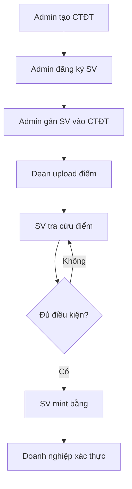

# 🎓 Blockchain Student Management System

Hệ thống quản lý sinh viên và xác thực bằng tốt nghiệp trên Blockchain sử dụng Ethereum Smart Contract.

## 📋 Mục lục

- [Tổng quan](#-tổng-quan)
- [Tính năng chính](#-tính-năng-chính)
- [Công nghệ sử dụng](#-công-nghệ-sử-dụng)
- [Cài đặt](#-cài-đặt)
- [Hướng dẫn sử dụng](#-hướng-dẫn-sử-dụng)
- [Cấu trúc dự án](#-cấu-trúc-dự-án)
- [Smart Contract](#-smart-contract)
- [Quy trình làm việc](#-quy-trình-làm-việc)
- [Troubleshooting](#-troubleshooting)

## 🌟 Tổng quan

Hệ thống quản lý sinh viên phi tập trung sử dụng blockchain Ethereum, đảm bảo tính minh bạch, bảo mật và không thể giả mạo trong việc lưu trữ thông tin học tập và cấp bằng tốt nghiệp.

### Đặc điểm nổi bật

- ✅ **Minh bạch**: Mọi dữ liệu được ghi trên blockchain
- 🔒 **Bảo mật**: Sử dụng cryptography và smart contract
- 🚫 **Không thể giả mạo**: Dữ liệu immutable trên blockchain
- ⚡ **Hiệu suất cao**: Batch processing cho submit điểm
- 🎯 **Tự động hóa**: Xét tốt nghiệp và cấp bằng tự động

## 🚀 Tính năng chính

### 1. Quản lý Chương trình Đào tạo (Admin)
- Upload chương trình đào tạo (JSON)
- Quản lý môn học bắt buộc và tự chọn
- Quản lý nhóm môn tự chọn
- Gán class vào chương trình
- Xem preview chương trình

**File liên quan**: [`frontend/admin_programs.html`](frontend/admin_programs.html), [`frontend/admin_programs.js`](frontend/admin_programs.js)

### 2. Quản lý Sinh viên (Admin)
- Đăng ký sinh viên mới (đơn lẻ hoặc batch)
- Upload danh sách sinh viên từ Excel
- Cập nhật thông tin sinh viên
- Quản lý trưởng khoa (thêm/xóa quyền)
- Xem danh sách sinh viên

**File liên quan**: [`frontend/admin_students.html`](frontend/admin_students.html), [`frontend/admin_students.js`](frontend/admin_students.js)

### 3. Nhập Điểm (Trưởng khoa)
- Upload điểm từ Excel/CSV
- Preview và validate dữ liệu
- **Batch Submit**: Gộp tất cả sinh viên vào 1 transaction
- Submit từng sinh viên (cách cũ)
- Xem điểm đã nhập theo lớp/học kỳ
- Xuất báo cáo Excel

**File liên quan**: [`frontend/dean_students.html`](frontend/dean_students.html), [`frontend/dean_students.js`](frontend/dean_students.js)

### 4. Tra cứu Điểm & Mint Bằng (Sinh viên)
- Tra cứu điểm theo học kỳ
- Xem tổng kết toàn khóa (GPA, tín chỉ)
- Xét tốt nghiệp tự động
- Mint bằng tốt nghiệp lên blockchain
- Tải bằng dạng PDF/HTML
- Tạo QR code xác thực

**File liên quan**: [`frontend/student.html`](frontend/student.html), [`frontend/student.js`](frontend/student.js)

### 5. Xác thực Bằng (Doanh nghiệp)
- Quét QR code trên bằng
- Xác thực hash bằng trên blockchain
- Hiển thị thông tin chi tiết bằng
- Tự động kiểm tra tính hợp lệ

**File liên quan**: [`frontend/verify_diploma.html`](frontend/verify_diploma.html), [`frontend/verify_diploma.js`](frontend/verify_diploma.js)

## 🛠 Công nghệ sử dụng

### Backend & Blockchain
- **Solidity 0.8.20**: Smart contract language
- **Truffle**: Development framework
- **Ganache**: Local blockchain
- **Web3.js**: Blockchain interaction library

### Frontend
- **HTML5/CSS3**: UI/UX
- **JavaScript (ES6+)**: Client-side logic
- **SheetJS (XLSX)**: Excel file processing
- **QRCode.js**: QR code generation
- **CryptoJS**: SHA256 hashing

### Tools
- **MetaMask**: Wallet integration
- **Node.js**: Runtime environment
- **Python**: Local development server

## 📦 Cài đặt

### 1. Yêu cầu hệ thống
```bash
Node.js >= 14.x
NPM >= 6.x
Truffle >= 5.x
Ganache >= 7.x
MetaMask extension
```

### 2. Clone repository
```bash
git clone <repository-url>
cd student-blockchain-system
```

### 3. Cài đặt dependencies
```bash
npm install
```

### 4. Khởi động Ganache
```bash
ganache --chain.chainId 1337 --chain.networkId 1337 \
  --server.port 8545 --wallet.totalAccounts 20 \
  --mnemonic "broom trick volume shift unaware february wall involve divert render utility accuse"
```

### 5. Deploy smart contract
```bash
truffle migrate --reset --network development
```

### 6. Phân quyền
```bash
truffle exec setup_roles.js --network development
```

### 7. Cập nhật contract address cho frontend
```bash
node update_frontend_contract.js
```

### 8. Khởi động web server
```bash
cd frontend
python3 -m http.server 8082
```

### 9. Truy cập ứng dụng
```
http://127.0.0.1:8082/index.html
```

## 📖 Hướng dẫn sử dụng

### Bước 1: Kết nối MetaMask
1. Cài đặt MetaMask extension
2. Import private key từ Ganache
3. Kết nối với mạng Ganache (localhost:8545)

### Bước 2: Quản lý Chương trình (Admin)
1. Truy cập [`admin_programs.html`](frontend/admin_programs.html)
2. Kết nối MetaMask với account Admin (accounts[0])
3. Upload file JSON chương trình đào tạo
4. Gán class vào chương trình

**Ví dụ JSON chương trình**:
```json
{
  "programId": "TT&MMT2020",
  "programName": "Truyền thông và Mạng máy tính",
  "description": "Khóa 2020-2024",
  "totalCredits": 156,
  "minCredits": 156,
  "minGPA": 200,
  "blocks": [...]
}
```

### Bước 3: Đăng ký Sinh viên (Admin)
1. Truy cập [`admin_students.html`](frontend/admin_students.html)
2. **Tab "Upload file Excel"**:
   - Upload file Excel danh sách sinh viên
   - Preview dữ liệu
   - Batch Submit (khuyến nghị)
3. **Tab "Quản lý Trưởng khoa"**:
   - Thêm địa chỉ ví của Trưởng khoa

### Bước 4: Nhập Điểm (Trưởng khoa)
1. Truy cập [`dean_students.html`](frontend/dean_students.html)
2. Kết nối MetaMask với account Trưởng khoa
3. **Bước 1**: Upload file Excel điểm
4. **Bước 2**: Preview dữ liệu
5. **Bước 3**: Convert sang JSON
6. **Batch Submit** (khuyến nghị - nhanh gấp 10-100 lần)

**Cấu trúc file Excel điểm**:
```
F_MAMH | F_TENMHVN | F_DVHT | F_MASV | F_TENSV | F_TENLOP | F_DIEM2 | NHHK
FL103H | Ngữ âm 1  | 2      | B2014161| Lê Văn A| FL20V1F1| 9.2     | 20211
```

### Bước 5: Tra cứu & Mint Bằng (Sinh viên)
1. Truy cập [`student.html`](frontend/student.html)
2. Kết nối MetaMask với ví sinh viên
3. Nhập MSSV và tra cứu
4. Xem điểm và tổng kết
5. **Đăng ký xét tốt nghiệp**
6. Nếu đủ điều kiện → **Mint bằng**

### Bước 6: Xác thực Bằng (Doanh nghiệp)
1. Truy cập [`verify_diploma.html`](frontend/verify_diploma.html)
2. Quét QR code trên bằng
3. Hệ thống tự động xác thực hash trên blockchain

## 📁 Cấu trúc dự án

```
student-blockchain-system/
├── contracts/                      # Smart contracts
│   └── StudentManagement.sol       # Main contract
├── migrations/                     # Deployment scripts
├── frontend/                       # Web interface
│   ├── index.html                  # Landing page
│   ├── admin_programs.html         # Quản lý chương trình
│   ├── admin_students.html         # Quản lý sinh viên
│   ├── dean_students.html          # Nhập điểm
│   ├── student.html                # Tra cứu & mint bằng
│   └── verify_diploma.html         # Xác thực bằng
├── build/contracts/                # Compiled contracts
├── setup_roles.js                  # Script phân quyền
├── update_frontend_contract.js     # Update contract address
├── truffle-config.js               # Truffle configuration
└── package.json                    # Dependencies
```

## 🔐 Smart Contract

### Contract Address
```
0x0e068999591e59D0eAbff3491E2CD449B2B7D9f2
```

### Các chức năng chính

#### Quản lý Sinh viên
```solidity
function registerStudent(
    string memory studentId,
    string memory name,
    string memory class,
    // ... other params
) public onlyAdmin
```

#### Quản lý Điểm
```solidity
function batchSubmitGrades(
    string[] memory studentIds,
    string[] memory semesters,
    // ... grade data
) public onlyDean
```

#### Quản lý Bằng
```solidity
function mintDiploma(
    string memory studentId,
    string memory diplomaHash,
    // ... diploma data
) public
```

### Quyền hạn (Roles)
- **Owner/Admin**: Đăng ký sinh viên, quản lý chương trình, thêm/xóa Dean
- **Dean**: Submit điểm cho sinh viên
- **Student**: Tra cứu điểm, mint bằng của chính mình

## 🔄 Quy trình làm việc



### Chi tiết từng bước

1. **Admin tạo chương trình đào tạo**
   - Upload JSON chương trình
   - Gán class vào chương trình

2. **Admin đăng ký sinh viên**
   - Upload Excel danh sách SV
   - Batch Submit lên blockchain

3. **Dean nhập điểm**
   - Upload Excel điểm
   - Batch Submit (khuyến nghị)

4. **Sinh viên tra cứu**
   - Xem điểm theo học kỳ
   - Xem tổng kết toàn khóa

5. **Sinh viên xét tốt nghiệp**
   - Hệ thống tự động so sánh với CTĐT
   - Hiển thị môn còn thiếu

6. **Sinh viên mint bằng**
   - Generate hash bằng (SHA256)
   - Lưu hash lên blockchain
   - Tải bằng PDF + QR code

7. **Xác thực bằng**
   - Quét QR code
   - Kiểm tra hash trên blockchain

## ⚙️ Các tính năng nâng cao

### Batch Submit
- Gộp nhiều transaction vào 1
- Tiết kiệm gas fee (10-100 lần)
- Chỉ cần ký 1 lần trong MetaMask

### Atomic Transaction
- Tất cả sinh viên được submit cùng lúc
- Nếu 1 lỗi → tất cả rollback
- Đảm bảo tính toàn vẹn dữ liệu

### Validation Rules
- Không cho phép sửa điểm đã submit
- Chỉ tạo học kỳ mới
- Kiểm tra điều kiện tiên quyết
- Validate GPA và tín chỉ

### Tính GPA
- Lấy điểm cao nhất nếu học lại
- Tính GPA hệ 4 và hệ 10
- Xếp loại tự động (Xuất sắc, Giỏi, Khá, TB)

## 🐛 Troubleshooting

### Lỗi kết nối MetaMask
```
Error: Please connect MetaMask first
```
**Giải pháp**:
- Kiểm tra MetaMask đã cài đặt
- Kết nối với mạng Ganache (localhost:8545)
- Import private key từ Ganache

### Lỗi contract not found
```
Error: Contract not deployed at address
```
**Giải pháp**:
```bash
truffle migrate --reset --network development
node update_frontend_contract.js
```

### Lỗi permission denied
```
Error: Only Dean can submit grades
```
**Giải pháp**:
- Kiểm tra account hiện tại
- Admin cần thêm account vào danh sách Dean
- Qua tab "Quản lý Trưởng khoa" trong [`admin_students.html`](frontend/admin_students.html)

### Lỗi gas limit
```
Error: Gas limit exceeded
```
**Giải pháp**:
- Chia nhỏ batch thành nhiều phần
- Mỗi batch tối đa ~50 sinh viên
- Hoặc dùng submit từng cái

### Lỗi XLSX library not loaded
```
Error: XLSX is not defined
```
**Giải pháp**:
- Reload trang (Ctrl + F5)
- Kiểm tra internet connection
- CDN SheetJS có thể bị chặn

## 📊 Thống kê hiệu suất

### Batch Submit vs Submit từng cái

| Tiêu chí | Batch Submit | Submit từng cái |
|----------|--------------|-----------------|
| Số transaction | 1 | N (số sinh viên) |
| Số lần ký MetaMask | 1 | N |
| Thời gian (10 SV) | ~10-30s | ~2-3 phút |
| Thời gian (100 SV) | ~30-60s | ~20-30 phút |
| Gas cost | Tối ưu | Cao hơn 10-100 lần |

## 📝 Ghi chú quan trọng

### Quy tắc điểm số
- **Điểm chữ**: A (4.0), B+ (3.5), B (3.0), C+ (2.5), C (2.0), D+ (1.5), D (1.0), F (0)
- **Học lại**: Lấy điểm cao nhất, chỉ tính 1 lần tín chỉ
- **GPA**: Weighted average theo tín chỉ

### Điều kiện tốt nghiệp
- Hoàn thành đủ tín chỉ bắt buộc
- Hoàn thành đủ tín chỉ tự chọn
- GPA >= 2.0 (hệ 4)
- Không có môn F (trượt)

### Bảo mật
- Private key KHÔNG BAO GIỜ public
- Chỉ submit từ account được phân quyền
- Hash bằng sử dụng SHA256
- Blockchain immutable

## 🤝 Đóng góp

Mọi đóng góp đều được hoan nghênh! Vui lòng:
1. Fork repository
2. Tạo branch mới
3. Commit changes
4. Push và tạo Pull Request

## 📄 License

MIT License - see LICENSE file for details

## 📞 Liên hệ

- **Email**: support@example.com
- **Website**: https://example.com
- **Documentation**: Xem các file HTML trong [`frontend/`](frontend/)

---

**Lưu ý**: Đây là hệ thống demo, không sử dụng cho production mà không có audit bảo mật đầy đủ.